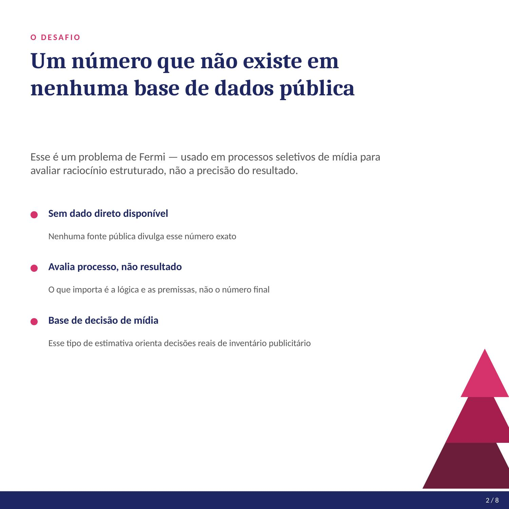
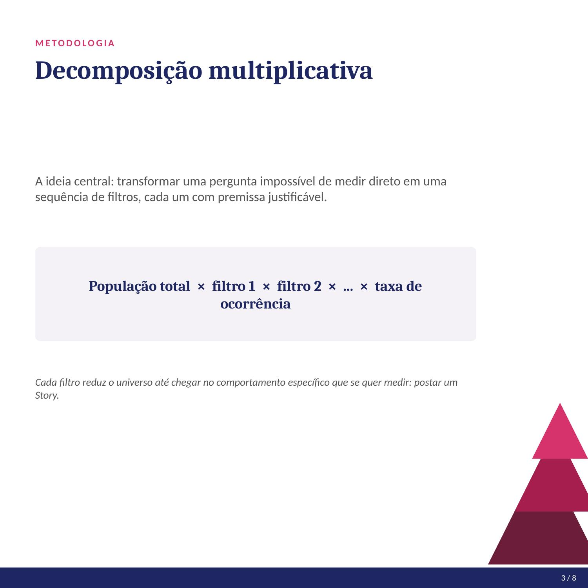
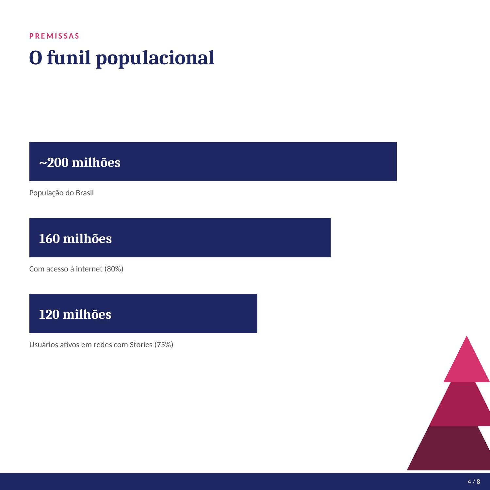
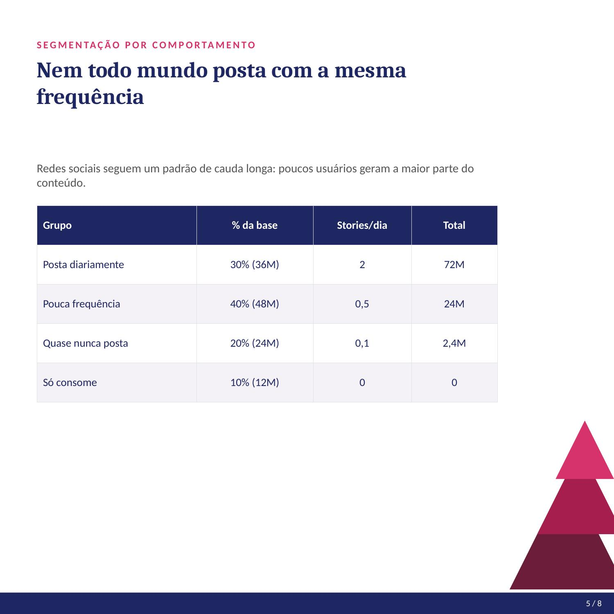
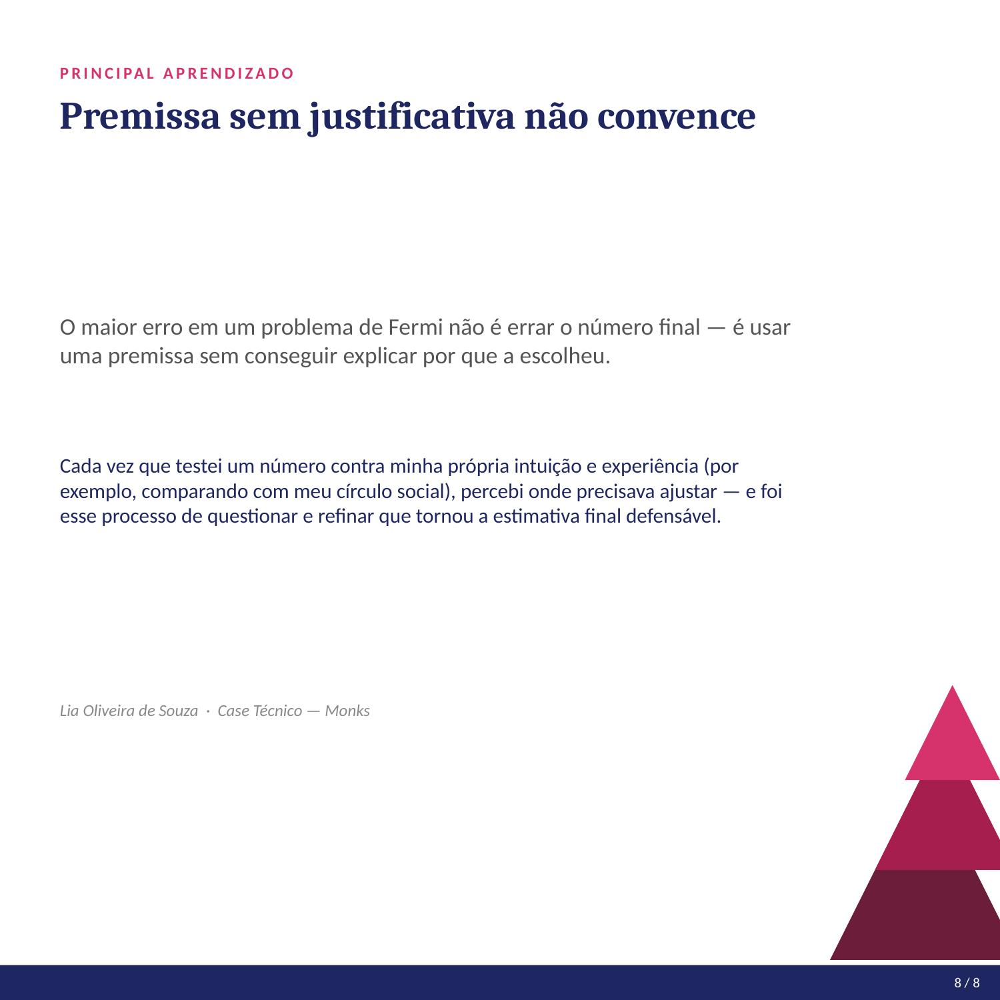

# Quantos Stories são postados no Brasil por dia?

Case desenvolvido durante o processo seletivo de estágio em **Mídias de Performance** — estimativa construída com a metodologia Fermi.

## O desafio

Estimar, sem nenhum dado oficial disponível, quantos Stories são postados diariamente no Brasil. Esse tipo de problema (conhecido como "problema de Fermi") avalia raciocínio estruturado e capacidade de justificar premissas, não a precisão do resultado final.

## Metodologia

A estimativa foi construída por decomposição multiplicativa: partindo da população total do Brasil, apliquei uma sequência de filtros (acesso à internet → uso ativo de redes com Stories → frequência de postagem por comportamento), cada um com uma premissa justificada.

```
População total × filtro 1 × filtro 2 × ... × taxa de ocorrência
```

### Funil de premissas

| Etapa | Valor |
|---|---|
| População do Brasil | ~200 milhões |
| Com acesso à internet (80%) | 160 milhões |
| Usuários ativos em redes com Stories (75%) | 120 milhões |

### Segmentação por comportamento

| Grupo | % da base | Stories/dia | Total |
|---|---|---|---|
| Posta diariamente | 30% (36M) | 2 | 72M |
| Pouca frequência | 40% (48M) | 0,5 | 24M |
| Quase nunca posta | 20% (24M) | 0,1 | 2,4M |
| Só consome, nunca posta | 10% (12M) | 0 | 0 |

## Resultado

**~98,4 milhões de Stories postados por dia no Brasil**

**Sanity check:** 98,4M ÷ 120M usuários ativos = 0,82 Stories/dia por usuário — plausível, considerando que a maioria consome mais conteúdo do que produz.

## Relevância para o negócio

Esse volume indica um inventário publicitário robusto e constante no formato Stories no Brasil, relevante para decisões de alocação de budget entre formatos (Stories vs. Feed vs. Reels) e para estratégias de frequência e alcance em campanhas de mídia.

## Principal aprendizado

O maior erro em um problema de Fermi não é errar o número final — é usar uma premissa sem conseguir justificar por que a escolheu. Testar cada número contra a intuição e revisar quando necessário foi o que tornou a estimativa final defensável.

## Apresentação completa










## Arquivos

- `case_stories_carrossel.pptx` — apresentação editável
- `case_stories_carrossel.pdf` — versão para visualização rápida
- `imagens/` — slides individuais em JPG

---

*Lia Oliveira de Souza · Case Técnico*
